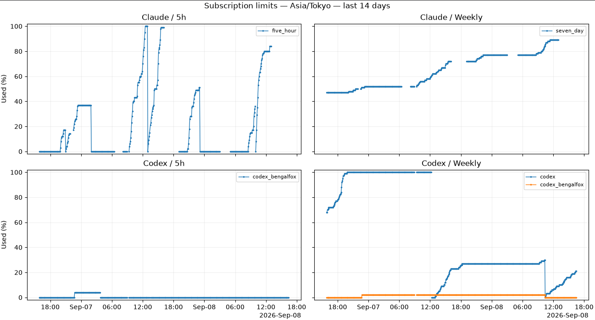

# agent_limit_history

Periodically fetch Claude Code / Codex subscription usage and store it in SQLite.
`collect` uses the Python standard library; `plot` uses matplotlib.
Usage is not estimated from token counts or equivalent API costs.



## Requirements

- Python 3.10 or later.
- Claude Code with existing OAuth credentials in `~/.claude/.credentials.json`
  and/or a signed-in Codex CLI available as `codex` on PATH.
- matplotlib for plotting; tkinter for `--show`.

Run commands from the repository directory. Collection uses the current Python
interpreter for Claude and launches `codex app-server` directly for Codex.
Use `--providers claude` or `--providers codex` to collect just one service.

To run collectors through a sandbox or another launcher, set `--claude-command`
and/or `--codex-command`. Each value is split with Python's `shlex.split` and
executed without a shell; quote paths containing spaces inside the value.
The Claude command must emit one JSON object with `observed_at` (UTC epoch seconds)
and `windows` (arrays of `[bucket, window_minutes, used_percent, resets_at]`),
or an `error` string on failure. The built-in `_fetch-claude` command implements
this format. The Codex command must start an app-server speaking the stdio RPC
protocol. `collect -n` prints commands without executing them or creating the DB.

## Collection and storage

- Claude: send a GET request to `https://api.anthropic.com/api/oauth/usage`.
  Read the existing OAuth access token from `~/.claude/.credentials.json` and add
  `anthropic-beta: oauth-2025-04-20`. Store `five_hour` and `seven_day*`.
  This is an internal CLI endpoint; the collector must be updated if it changes.
- Codex: start the installed CLI's `app-server` over stdio, then send
  `initialize` → `initialized` → `account/rateLimits/read`.
  No threads or turns are created. Store each limit in `rateLimitsByLimitId`,
  falling back to `rateLimits` on versions that do not support it.
  Classify windows by `windowDurationMins`, since `primary` is not always 5h.
- Neither collector sends inference requests. Missing usage values are not replaced with 0%.
- Credentials, response bodies, prompts, and conversation history are never stored
  in the DB or logs. Collection exceptions are recorded by type only;
  HTTP / RPC errors are recorded by code only.
- Default DB location: `data/history.sqlite3` in the script's directory.
  Override it with `--db`.
  Store the observation time in UTC epoch seconds, service, limit identifier,
  window duration in minutes, usage percentage, and reset time.
  Failures are also recorded in `observations`; a failure in one service does not
  stop the other. Use WAL and transactions, with umask 0077 for new files.
- Cached values are not recorded again as current observations. Each successful query is saved.

This script does not refresh Claude tokens. Normal Claude Code use handles refreshes. If HTTP 401 errors persist, check Claude authentication
on the collection host. Rate limiting (429), network failures, and expired credentials
are recorded as failed observations; run `collect` again to retry.
Schedule `collect` with a timer or cron job for periodic collection.

## Commands (fish / bash)

```sh
# Collect usage, or preview collection without executing it
python3 ./agent_limit_history.py -q collect
python3 ./agent_limit_history.py collect -n
# Plot the last 14 days (the extension selects PNG / SVG / PDF)
python3 ./agent_limit_history.py -q plot --days 14 --output /tmp/agent-limits.png
# Open a window with zoom and pan controls (add --output to save it as well)
python3 ./agent_limit_history.py -q plot --days 14 --show
# Use an online backup instead of copying a live WAL database file on its own
python3 ./agent_limit_history.py -q snapshot --output /tmp/agent-limits.sqlite3
# Tests (standard library only)
python3 -m unittest discover -s ./ -p agent_limit_history_test.py
```

`--show` opens a window using matplotlib's TkAgg backend. Use the toolbar's magnifying
glass to zoom, hand to pan, and home icon to reset the view. All four panels share
axes, so adjusting one panel affects all four.
The GUI backend requires tkinter (part of CPython; `python3-tk` on Debian-based systems).
With `--show`, no file is written unless `--output` is explicitly provided.
Do not use `--show` in headless environments without a display.

The plot has four panels: Claude / Codex × 5h / weekly. Additional model-specific
limits are plotted separately by identifier. The vertical axis shows usage (0–100%);
the horizontal axis defaults to UTC (override with `--timezone`, for example `--timezone Europe/London`).
Failed or missing observations become NaN. Lines break at observation gaps longer
than 15 minutes and actual window transitions. Fractional-second jitter in reset
times, or an unused window's expiry advancing with each query, does not count as
a transition. Windows of unknown duration are stored in the DB but omitted from
the four-panel plot.

## License

Licensed under the Apache License, Version 2.0. See [LICENSE](LICENSE).
